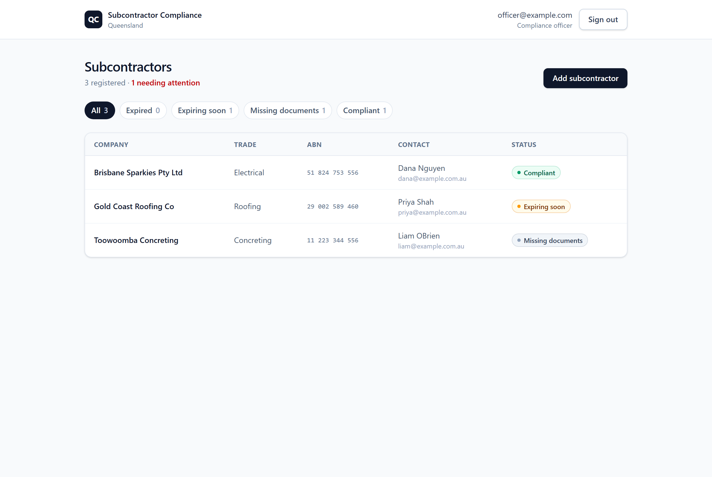
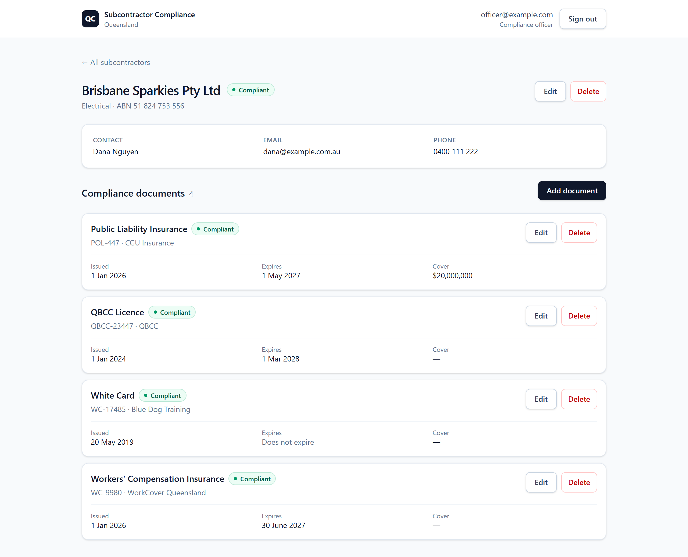
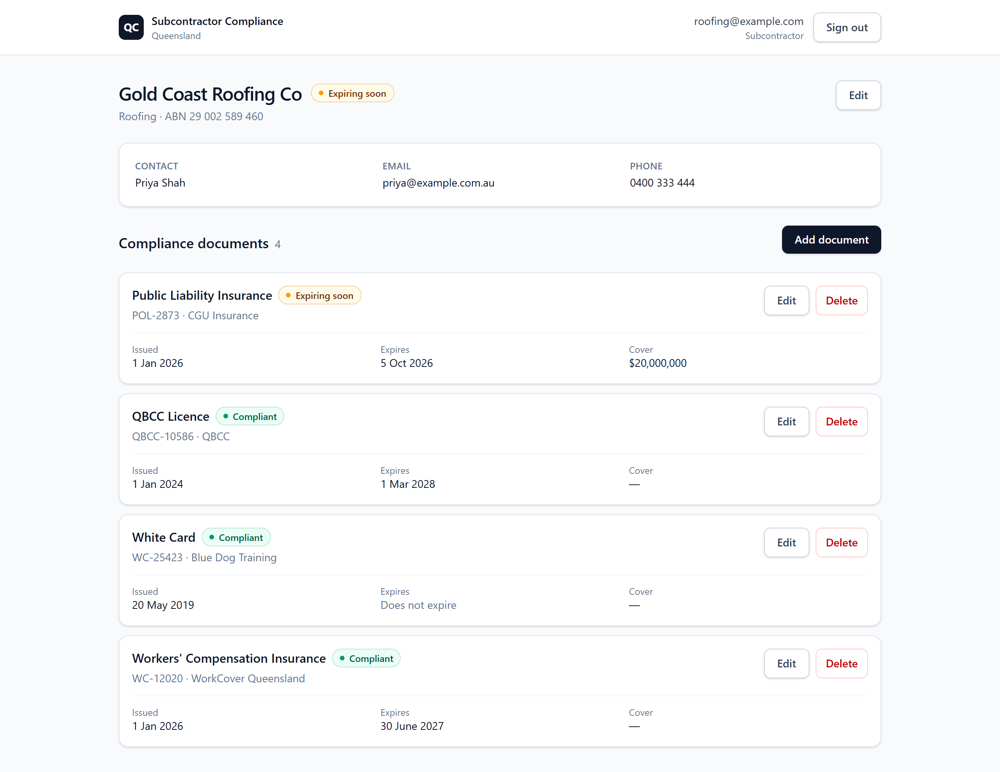
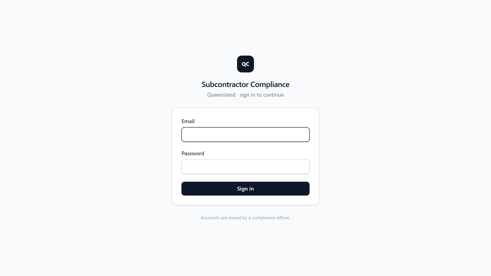
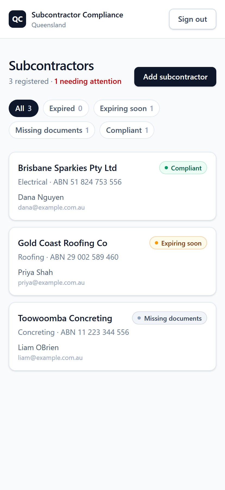

# Subcontractor Compliance Portal (QLD)

Contract-first serverless app for tracking Queensland construction subcontractor
compliance — QBCC licences, public liability and workers' compensation insurance,
and White Cards — with expiry-aware status tracking.

Built with Python on AWS (Lambda, DynamoDB, API Gateway, Cognito, CDK) and a
React + TypeScript frontend.

## Screenshots

A compliance officer sees every subcontractor, filterable by status:



Each subcontractor's documents, with expiry-derived status per document. Note
the White Card, which does not expire:



A subcontractor signs into the same app and sees only their own record — no
list, no delete, and the API refuses anything outside their scope:



<details>
<summary>Sign-in and mobile</summary>





</details>

## The domain

Queensland head contractors are exposed if a subcontractor works without current
cover, so the app tracks the documents that actually matter under QLD rules:

| Document | Issued by | Expires? |
| --- | --- | --- |
| QBCC licence | Queensland Building and Construction Commission | Yes |
| Public liability insurance | Insurer (certificate of currency) | Yes |
| Workers' compensation insurance | WorkCover Queensland | Yes |
| White Card (construction induction) | Registered training organisation | **No** |
| Professional indemnity insurance | Insurer — design/certification trades only | Yes |

The first four are required of every subcontractor. Professional indemnity is
tracked but excluded from the compliance rollup, since it only applies to some
trades.

### Status rules

A document is `EXPIRED` past its expiry, `EXPIRING_SOON` within 30 days, else
`VALID`. A White Card has no expiry and is `VALID` once on file.

A subcontractor's overall status takes the **best** status within each document
type, then the **worst** across the required types:

- Best-within-type — holding a lapsed 2024 certificate *and* a current one is
  not a breach; the old one is history.
- Worst-across-types — one expired requirement makes the subcontractor
  non-compliant.
- Any required type with no record at all yields `MISSING_DOCS`.

## Architecture

```
                 Cognito
                    │ ID token
                    v
React SPA  ──>  API Gateway  ──>  Lambda (Python)  ──>  DynamoDB
                (authorizer)            │
                     EventBridge (daily) ┘
```

- **Two DynamoDB tables**, `Subcontractors` and `ComplianceDocuments`, the latter
  with a `bySubcontractorId` GSI. Two tables rather than single-table design —
  the access patterns here are simple enough that the added indirection would
  cost more in clarity than it saves in requests.
- **Lambda per resource**, each routing on HTTP method. No third-party routing
  library, so the deployment package has no dependencies to bundle — `boto3`
  already ships in the Lambda runtime.
- **Least-privilege IAM**: each function is granted only the tables it uses.
- **CDK (Python)** defines all of it; `cdk deploy` is the only deployment step.

### Authentication and roles

A Cognito authorizer validates the JWT at API Gateway, so an unauthenticated
request is rejected at the edge and never reaches a Lambda. Every endpoint
requires a token except `/health`, which stays open as a liveness check.

Two Cognito groups carry different authority:

| | Compliance officer | Subcontractor |
| --- | --- | --- |
| See every subcontractor | Yes | No — only their own |
| Onboard / delete a subcontractor | Yes | No |
| Edit a subcontractor's details | Any | Their own |
| Manage compliance documents | Any | Their own |

A subcontractor login is bound to its record by a `custom:subcontractorId`
claim carried **in the token**, so a request arrives already scoped and the
Lambda needs no extra lookup to know what the caller owns.

Authorization is enforced server-side; the UI hides what a role cannot do, but
that is a courtesy, not the control. Documents are addressed by their own id,
where the owner is not in the URL — those are loaded first and authorized
against the record's subcontractor, so one tenant cannot reach another's
document by guessing an id.

### Denormalized compliance status

`complianceStatus` is **stored** on the subcontractor record rather than derived
per read, so the list view is a single query instead of N+1.

That trade has a catch: stored derived state goes stale on its own. A certificate
lapsing overnight triggers no write, so nothing would update the record. Status is
therefore recomputed on two triggers:

1. **On write** — any document create/update/delete re-derives its subcontractor's
   status immediately.
2. **On schedule** — an EventBridge rule runs a Lambda daily at 14:00 UTC
   (midnight Brisbane) to catch purely time-driven transitions.

### Observability

Handlers emit one structured JSON line per request, so CloudWatch Logs
Insights can filter on real fields rather than grepping prose:

```json
{"level":"INFO","message":"request","requestId":"cf248699","method":"GET",
 "route":"/subcontractors/{subcontractorId}","userId":"c9dec4b8",
 "userEmail":"roofing@example.com","userGroups":["Subcontractor"],
 "durationMs":0.1,"status":403}
```

The route is logged as its template rather than the concrete path, so queries
group by endpoint instead of scattering across record ids. Each line records
who made the request — in a compliance system, knowing *who was refused* is
part of the audit trail, not just debugging.

```
fields @timestamp, userEmail, route, status
| filter status = 403
| sort @timestamp desc
```

## Continuous integration and deployment

GitHub Actions runs backend tests, infrastructure tests, and a frontend
lint/typecheck/build on every push and pull request. A push to `master`
additionally deploys, gated on those tests passing.

Deployment authenticates by **OIDC role assumption** — no AWS access keys are
stored in GitHub. The workflow trades its short-lived GitHub identity token
for temporary AWS credentials, and the IAM role's trust policy is scoped to
this repository, so no other repo can assume it. The role itself holds no
deployment permissions; it may only step into CDK's own bootstrap roles.

The role is created by a second stack, deployed once by hand:

```bash
cd infra && cdk deploy CompliancePortalCicdStack
```

Then set its output as a repository variable named `AWS_DEPLOY_ROLE_ARN`
(Settings → Secrets and variables → Actions → Variables).

## Layout

See [docs/workflow.md](docs/workflow.md) for the development loop, the
deployment pipeline, and how a request moves through the system.

```
backend/     Lambda handlers, domain logic, DynamoDB repository (Python)
infra/       CDK app defining every AWS resource (Python)
frontend/    React + TypeScript + Vite SPA
openapi.yaml The API contract, written before the code
.github/     CI and deployment workflows
```

## Running it

### Backend and infrastructure

```bash
cd infra
.venv/Scripts/python -m pip install -r requirements.txt
cdk deploy
```

Deploys to whichever account and region your AWS CLI is configured for, and
prints the API URL on completion.

### Frontend

```bash
cd frontend
npm install
cp .env.example .env     # fill in the API URL and the Cognito ids
npm run dev
```

`cdk deploy` prints `UserPoolId` and `UserPoolClientId`; the API URL is the
`ComplianceApiEndpoint` output.

### Creating the first user

Self sign-up is disabled, so accounts are issued via the CLI. A compliance
officer needs a group; a subcontractor also needs binding to their record.

```bash
POOL=<UserPoolId from cdk deploy>

# Compliance officer
aws cognito-idp admin-create-user --user-pool-id $POOL   --username officer@example.com   --user-attributes Name=email,Value=officer@example.com Name=email_verified,Value=true   --message-action SUPPRESS
aws cognito-idp admin-set-user-password --user-pool-id $POOL   --username officer@example.com --password '<a strong password>' --permanent
aws cognito-idp admin-add-user-to-group --user-pool-id $POOL   --username officer@example.com --group-name ComplianceOfficer

# Subcontractor, bound to the record they may manage
aws cognito-idp admin-create-user --user-pool-id $POOL   --username subbie@example.com   --user-attributes Name=email,Value=subbie@example.com Name=email_verified,Value=true                     Name=custom:subcontractorId,Value=<subcontractor id>   --message-action SUPPRESS
aws cognito-idp admin-add-user-to-group --user-pool-id $POOL   --username subbie@example.com --group-name Subcontractor
```

### Tests

```bash
cd backend && .venv/Scripts/python -m pytest   # domain logic and validation
cd infra   && .venv/Scripts/python -m pytest   # CDK synthesises the expected resources
```

## Not included

- **Document files.** The app stores a certificate's metadata — reference
  number, issuer, dates — not the PDF itself. Real use would keep the evidence
  in S3.
- **Notifications.** The daily job computes status but tells nobody; the
  obvious next step is it chasing a subcontractor whose cover is lapsing.
- **A verification step.** Nobody confirms a certificate is genuine; the app
  trusts what was entered.
- **Alerting.** Structured logs are queryable but nothing pages anyone.
